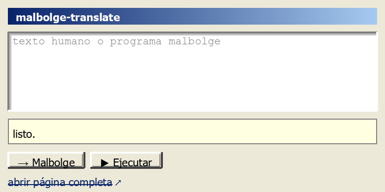

# Danny Baanks

I build interpreters, runtimes, agents, and other questionable ideas — then make them prove themselves.

## ISyCo — Interactive Systems for Coevolution

**Human ↔ AI ↔ Evidence** — results born from joint iterations, not single authorship.

An experiment in practice: human direction (questions, goals, constraints, and decisions) feeds back into implementations, analysis, and artifacts generated by models. Each piece of runtime evidence guides the next round.

### The loop

```
human attempt
     ↓
model: reasoning / implementation
     ↓
artifact
     ↓
runtime / experiment / evidence
     ↓
human reinterpretation → new direction
```

### Provenance

- Human ≠ ISyCo
- AI ≠ ISyCo
- Human ⊕ AI ⊕ Evidence ⊕ Iteration → ISyCo

### What matters

- Authorship belongs to the process, not a single agent.
- Human decisions and execution evidence constrain technical claims.
- The goal is to produce useful, verifiable, reproducible artifacts through coevolution.

## Webolge

Write text. Get executable Malbolge. Verify it locally. :p

[](https://malbolge-translate.pages.dev/)

> **Preview, not a widget:** GitHub READMEs don't run extensions.
> To use Webolge for real, [open the full page](https://malbolge-translate.pages.dev/)
> or load the [`malbolge-translate`](https://github.com/DannyBaanks/malbolge-translate) extension.

<details>
<summary><b>Run it locally</b></summary>

1. `git clone https://github.com/DannyBaanks/malbolge-translate`
2. Open `chrome://extensions` (works in any Chromium-based browser: Chrome, Edge, Brave…)
3. Enable **Developer mode**
4. **Load unpacked** → select the cloned folder (the one with `manifest.json`)
5. Click the extension icon → **malbolge·translate**

</details>

**What it actually does** (verified in [`app.js`](https://github.com/DannyBaanks/malbolge-translate)):

- text → Malbolge, **re-executed and only shown if output matches** (`generate → run → output === input → HALTED`)
- Malbolge → text, executed locally with step/output limits
- long texts via batch mode: worker thread, IndexedDB checkpoints, pause/resume, independent verified chunks
- exports: `webolge_programas.txt` for humans · `webolge_job.json` for machines

TXT for humans · JSON for machines · verified Malbolge underneath.

## Malbolge ecosystem

Because one cursed program is never enough:

- **[malbolge-translate](https://github.com/DannyBaanks/malbolge-translate)** — the browser tool above (Webolge)
- **[Malbolge-Translator](https://github.com/DannyBaanks/Malbolge-Translator)** — incremental machine-state synthesis in Python: arbitrarily long text → one linear Malbolge program, anchor-state word bank, byte-exact UTF-8 roundtrips
- **[Malbolge-Engine](https://github.com/DannyBaanks/Malbolge-Engine)** — the runtime underneath

## Also somewhere in here

Interpreters, esolangs, evidence pipelines, and experiments whose negative results I keep.

---

<sub>Serious payload. Unserious headers.</sub>
